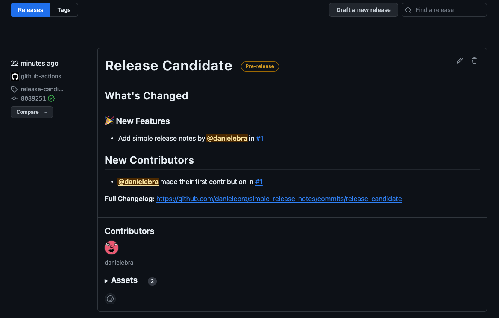

# Simple Release Notes

A drop-in github action to generate release notes.


## Setup

### `changelog` via `release.yml`

Create a `.github/release.yml`

This will define the categorial structure of the release notes. When a pull request label matches an entry in the `release.yml`, it will be placed under the respective section. It matched against the first label to have an entry in the `categories` section.

Sample `release.yml`

``` yaml
changelog:
  categories:
    - title: 🎉 New Features
      labels:
        - new feature
    - title: ✨ Enhancements
      labels:
        - enhancement
    - title: 🛠 Breaking Changes
      labels:
        - breaking change
    - title: 🐛 Bug fixes
      labels:
        - bug
    - title: ⚡️ Optimisations
      labels:
        - optimisation
    - title: 🔭 Observability
      labels:
        - observability
    - title: 🔒️ Security
      labels:
        - security
    - title: 📝 Documentation
      labels:
        - documentation
    - title: 📦️ Dependencies
      labels:
        - dependencies
    - title: Other Changes
      labels:
        - '*'
```

### Integrate

#### Candidate

A long-lived mutable `release-candidate` tag can optionally be managed through the action `reusable-update-release-candidate-notes.yml`.

This will persist a single release instance for candidate changes that moves when changes are being made to your repository.

``` yaml
jobs:
  update-candidate:
    name: Update Release Candidate Notes
    permissions:
      id-token: write
      contents: write
    secrets: inherit
    uses: danielebra/simple-release-notes/.github/workflows/reusable-update-release-candidate-notes.yml
    with:
      branch-with-candidate-code: main
```

This image demonstrates a release candidate managed by the above workflow.



#### Latest Release

The latest release is managed by detecting the current latest release before creating a new one. Given this spread, release notes will automatically be generated, alongside a change diff. A release will be published that is now marked as `latest`. The release title is named after the tag of the release.

``` yaml
jobs:
  create-release
    name: Create Release Notes
    permissions:
      id-token: write
      contents: write
    secrets: inherit
    uses: danielebra/simple-release-notes/.github/workflows/reusable-create-release-notes.yml
    with:
      tag: v1.0.0
```
