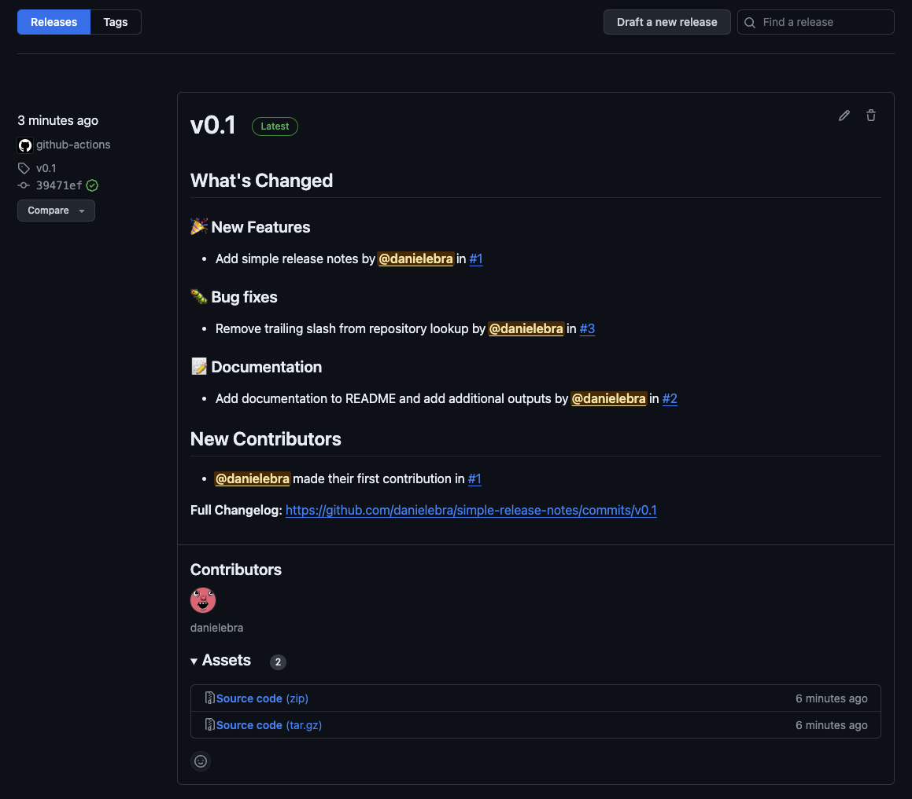

# Simple Release Notes

A batteries-included and opinionated drop-in solution to generating and managing github release notes.

## Overview

Two main workflows

### `reusable-update-release-candidate-notes.yml`

#### Inputs

| Input                        | Required | Type   | Default | Description                                                                                                                             |
|------------------------------|----------|--------|---------|-----------------------------------------------------------------------------------------------------------------------------------------|
| `branch-with-candidate-code` | No       | string |         | Optionally provide a specific branch that contains the candidate code, otherwise the default branch of the repository will be selected. |

#### Outputs

| Output             | Description                                             |
|--------------------|---------------------------------------------------------|
| `CANDIDATE_BRANCH` | The branch that was used to generate release notes from |
| `CANDIDATE_COMMIT` | The latest commit hash from the candidate branch        |
| `URL`              | Link to the release candidate                           |

### `reusable-create-release-notes.yml`

#### Inputs

| Input                                | Required | Type    | Default | Description                                                  |
|--------------------------------------|----------|---------|---------|--------------------------------------------------------------|
| `tag`                                | Yes      | string  |         | Tag to associate the release to. Can be new or existing.     |
| `auto-clear-release-candidate-notes` | No       | boolean | `true`  | Whether the notes of the release candidate should be cleared |

#### Outputs

| Output | Description         |
|--------|---------------------|
| `URL`  | Link to the release |

## Setup

### `changelog` via `release.yml`

Create a `.github/release.yml`

This will define the categorial structure of the release notes. When a pull request label matches an entry in the `release.yml`, it will be placed under the respective section. It matched against the first label to have an entry in the `categories` section.

Sample `release.yml`

``` yaml
changelog:
  categories:
    - title: 🎉 New Features
      labels:
        - new feature
    - title: ✨ Enhancements
      labels:
        - enhancement
    - title: 🛠 Breaking Changes
      labels:
        - breaking change
    - title: 🐛 Bug fixes
      labels:
        - bug
    - title: ⚡️ Optimisations
      labels:
        - optimisation
    - title: 🔭 Observability
      labels:
        - observability
    - title: 🔒️ Security
      labels:
        - security
    - title: 📝 Documentation
      labels:
        - documentation
    - title: 📦️ Dependencies
      labels:
        - dependencies
    - title: Other Changes
      labels:
        - '*'
```

### Integrate

#### Candidate

A long-lived mutable `release-candidate` tag can optionally be managed through the action `reusable-update-release-candidate-notes.yml`.

This will persist a single release instance for candidate changes that moves when changes are being made to your repository.

``` yaml
jobs:
  update-candidate:
    name: Update Release Candidate Notes
    permissions:
      id-token: write
      contents: write
    uses: danielebra/simple-release-notes/.github/workflows/reusable-update-release-candidate-notes.yml
    with:
      branch-with-candidate-code: main
```

This image demonstrates a release candidate managed by the above workflow.


#### Latest Release



The latest release is managed by detecting the current latest release before creating a new one. Given this spread, release notes will automatically be generated, alongside a change diff. A release will be published that is now marked as `latest`. The release title is named after the tag of the release.

``` yaml
jobs:
  create-release
    name: Create Release Notes
    permissions:
      id-token: write
      contents: write
    uses: danielebra/simple-release-notes/.github/workflows/reusable-create-release-notes.yml
    with:
      tag: v1.0.0
```

The default behaviour of the `reusable-create-release-notes` workflow will automatically clear the release notes from the candidate release. To disable candidate notes, you can opt-out of this via 

``` yaml
with:
  auto-clear-release-candidate-notes: false
```
